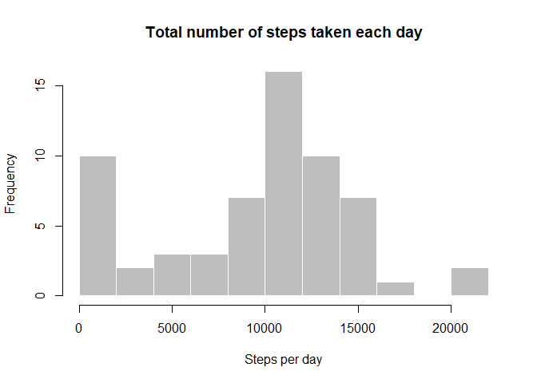
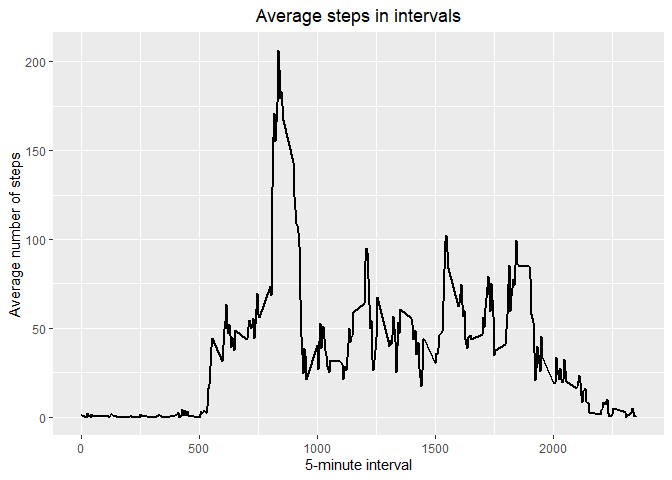
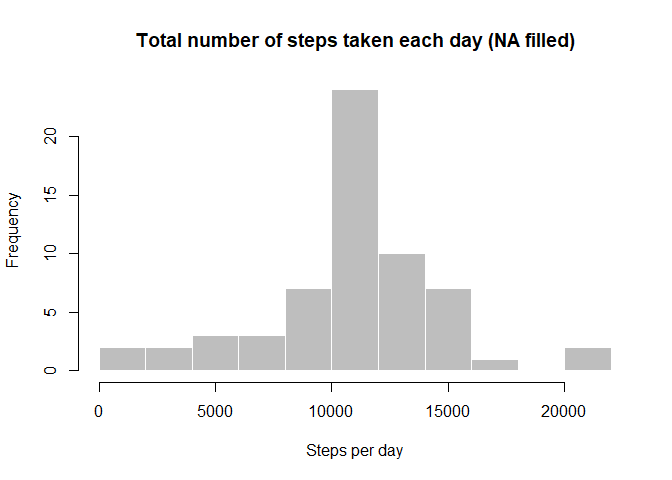
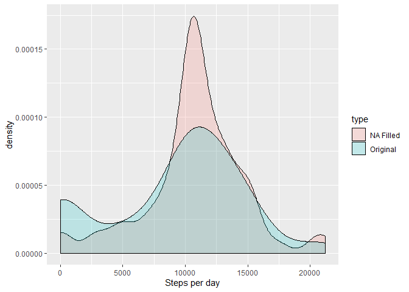

## Assignment

This assignment will be described in multiple parts. You will need to write a report that answers the questions detailed below. Ultimately, you will need to complete the entire assignment in a single R markdown document that can be processed by knitr and be transformed into an HTML file.

Throughout your report make sure you always include the code that you used to generate the output you present. When writing code chunks in the R markdown document, always use \color{red}{\verb|echo = TRUE|}echo=TRUE so that someone else will be able to read the code. This assignment will be evaluated via peer assessment so it is essential that your peer evaluators be able to review the code for your analysis.

For the plotting aspects of this assignment, feel free to use any plotting system in R (i.e., base, lattice, ggplot2)

Fork/clone the GitHub repository created for this assignment. You will submit this assignment by pushing your completed files into your forked repository on GitHub. The assignment submission will consist of the URL to your GitHub repository and the SHA-1 commit ID for your repository state.

NOTE: The GitHub repository also contains the dataset for the assignment so you do not have to download the data separately.

## Loading and preprocessing the data
Show any code that is needed to

1. Load the data (i.e. read.csv())


```r
# packages used -- need to load these
library(dplyr)
```

```
## 
## Attaching package: 'dplyr'
```

```
## The following objects are masked from 'package:stats':
## 
##     filter, lag
```

```
## The following objects are masked from 'package:base':
## 
##     intersect, setdiff, setequal, union
```

```r
library(ggplot2)
library(stringr)
library(lubridate)
```

```
## Warning: package 'lubridate' was built under R version 3.6.2
```

```
## 
## Attaching package: 'lubridate'
```

```
## The following object is masked from 'package:base':
## 
##     date
```

```r
# clear environment
rm(list=ls())

# unzip file - need to add your own directory here
unzip("E:/R/workdir/activity.zip")

# loading unzipped csv file
activity_data <- read.csv("activity.csv", stringsAsFactors = FALSE)
```

2. process/transform the data (if necessary) into a format suitable for your analysis


```r
# distinct cummulative count function
dist_cum <- function(inVar)
  sapply(seq_along(inVar), function(x) length(unique(head(inVar, x))))

activity_data_modified <- activity_data %>%
  mutate(date = as_date(date, yymmdd), # change to date
         no_of_days = dist_cum(date), # get number of days
         weekday = wday(date)) # get days of the week
```


## What is mean total number of steps taken per day?
1. Calculate the total number of steps taken per day


```r
total_steps_per_day <- activity_data_modified %>%
  group_by(date) %>%
  summarise(steps_per_day = sum(steps, na.rm = TRUE))

head(total_steps_per_day, 10)
```

```
## # A tibble: 10 x 2
##    date       steps_per_day
##    <date>             <int>
##  1 2012-10-01             0
##  2 2012-10-02           126
##  3 2012-10-03         11352
##  4 2012-10-04         12116
##  5 2012-10-05         13294
##  6 2012-10-06         15420
##  7 2012-10-07         11015
##  8 2012-10-08             0
##  9 2012-10-09         12811
## 10 2012-10-10          9900
```

2. If you do not understand the difference between a histogram and a barplot, research the difference between them. Make a histogram of the total number of steps taken each day


```r
hist(total_steps_per_day$steps_per_day,
     main = "Total number of steps taken each day",
     xlab = "Steps per day",
     col = "grey",
     border = "white",
     breaks = 10)
```

<!-- -->


3. Calculate and report the mean and median of the total number of steps taken per day


```r
average_steps_per_day <- total_steps_per_day %>%

  # mean/median of total steps per day excluding 0
  summarise(mean_steps = mean(steps_per_day[steps_per_day != 0], na.rm = TRUE), 
            median_steps = median(steps_per_day[steps_per_day != 0], na.rm = TRUE)) 

head(average_steps_per_day, 10)
```

```
## # A tibble: 1 x 2
##   mean_steps median_steps
##        <dbl>        <int>
## 1     10766.        10765
```


## What is the average daily activity pattern?

1. Make a time series plot (i.e. \color{red}{\verb|type = "l"|}type="l") of the 5-minute interval (x-axis) and the average number of steps taken, averaged across all days (y-axis)


```r
mean_steps_by_interval <- activity_data_modified %>%
  group_by(interval) %>%
  summarise(mean_steps = mean(steps, na.rm = TRUE))

# head(mean_steps_by_interval, 10)

ggplot(mean_steps_by_interval, aes(x = interval, y = mean_steps)) + 
  geom_line(size = 1) +
  labs(title = "Average steps in intervals", 
       x = "5-minute interval", y = "Average number of steps") +
  theme(plot.title = element_text(hjust = 0.5))
```

<!-- -->

2. Which 5-minute interval, on average across all the days in the dataset, contains the maximum number of steps?


```r
print(paste("interval", mean_steps_by_interval$interval[which.max(mean_steps_by_interval$mean_steps)], "contains the maximum number of steps."))
```

```
## [1] "interval 835 contains the maximum number of steps."
```

## Imputing missing values

Note that there are a number of days/intervals where there are missing values (coded as \color{red}{\verb|NA|}NA). The presence of missing days may introduce bias into some calculations or summaries of the data.

1. Calculate and report the total number of missing values in the dataset (i.e. the total number of rows with \color{red}{\verb|NA|}NAs)


```r
print(paste("There are", sum(is.na(activity_data$steps)), "missing data."))
```

```
## [1] "There are 2304 missing data."
```

2. Devise a strategy for filling in all of the missing values in the dataset. The strategy does not need to be sophisticated. For example, you could use the mean/median for that day, or the mean for that 5-minute interval, etc.

I am using mean of the 5-minute interval to fill the missing data.

3. Create a new dataset that is equal to the original dataset but with the missing data filled in.


```r
activity_data_NA_filled <- activity_data %>%
  group_by(interval) %>%
  mutate(steps = ifelse(is.na(steps), mean(steps[!is.na(steps)]), steps))
```

4. Make a histogram of the total number of steps taken each day and Calculate and report the mean and median total number of steps taken per day. 


```r
total_steps_per_day_NA_filled <- activity_data_NA_filled %>%
  group_by(date) %>%
  summarise(steps_per_day = sum(steps, na.rm = TRUE))

hist(total_steps_per_day_NA_filled$steps_per_day,
     main = "Total number of steps taken each day (NA filled)",
     xlab = "Steps per day",
     col = "grey",
     border = "white",
     breaks = 10)
```

<!-- -->

```r
average_steps_per_day_NA_filled <- total_steps_per_day_NA_filled %>%

  # mean/median of total steps per day excluding 0
  summarise(mean_steps = mean(steps_per_day[steps_per_day != 0], na.rm = TRUE), 
            median_steps = median(steps_per_day[steps_per_day != 0], na.rm = TRUE)) 

head(average_steps_per_day_NA_filled, 10)
```

```
## # A tibble: 1 x 2
##   mean_steps median_steps
##        <dbl>        <dbl>
## 1     10766.       10766.
```


Do these values differ from the estimates from the first part of the assignment? 


```r
rbind(average_steps_per_day, average_steps_per_day_NA_filled) %>%
  mutate(type = c("Original", "NA Filled")) %>%
  select(type, everything())
```

```
## # A tibble: 2 x 3
##   type      mean_steps median_steps
##   <chr>          <dbl>        <dbl>
## 1 Original      10766.       10765 
## 2 NA Filled     10766.       10766.
```

```r
print("Mean steps are identical, but median steps have increased and shows identical number as the mean.")
```

```
## [1] "Mean steps are identical, but median steps have increased and shows identical number as the mean."
```


What is the impact of imputing missing data on the estimates of the total daily number of steps?


```r
original <- total_steps_per_day %>%
  select(steps_per_day) %>%
  mutate(type = "Original")

NA_filled <- total_steps_per_day_NA_filled %>%
  select(steps_per_day) %>%
  mutate(type = "NA Filled")


combined_data <- rbind(original, NA_filled)

ggplot(combined_data, aes(steps_per_day, fill = type)) + 
  geom_density(alpha = 0.2, aes(y= ..density..), position = 'identity') +
  xlab("Steps per day")
```

<!-- -->

```r
print("The distribution shows clearer peak at the centre towards the mean.")
```

```
## [1] "The distribution shows clearer peak at the centre towards the mean."
```


## Are there differences in activity patterns between weekdays and weekends?

For this part the \color{red}{\verb|weekdays()|}weekdays() function may be of some help here. Use the dataset with the filled-in missing values for this part.


